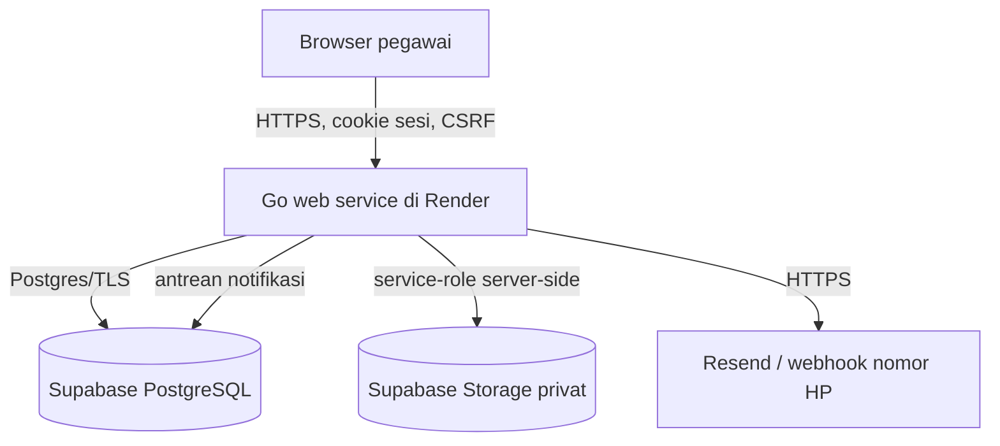
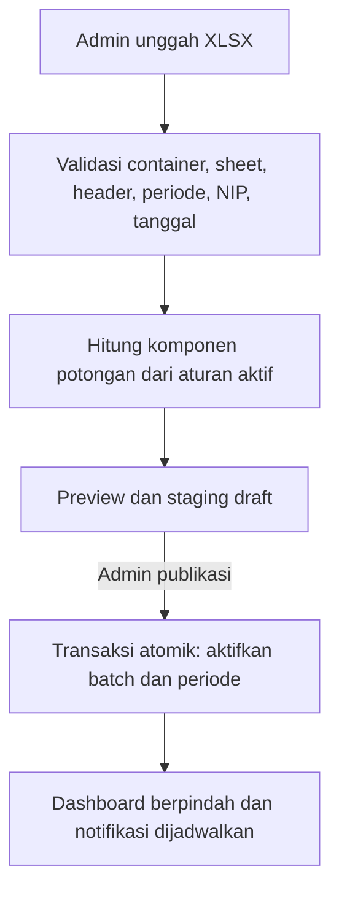
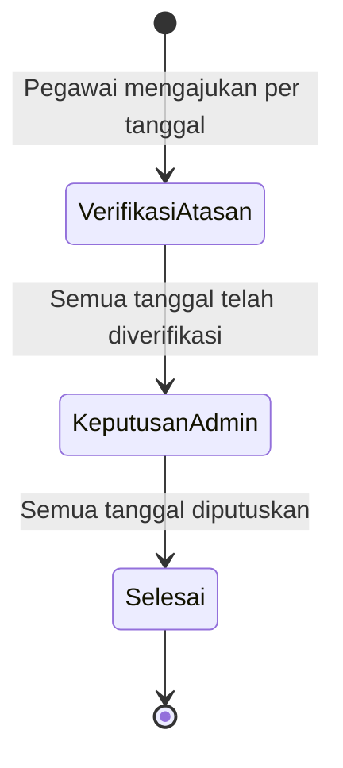

# Arsitektur PANTAS

## Komponen

Go menyajikan API dan aset web dari satu binary. Browser tidak menerima connection string database atau service-role key. Seluruh pemeriksaan kepemilikan dan lingkup organisasi dilakukan kembali di backend; menyembunyikan menu pada antarmuka bukan mekanisme otorisasi.

## Matriks akses

| Peran | Data pribadi | Monitoring | Banding yang diverifikasi |
|---|---|---|---|
| Staf | Diri sendiri | Tidak ada | Tidak ada |
| Kepala Seksi/Subbagian | Diri sendiri | Pegawai pada seksi/subbagian secara individual | Staf pada unit yang sama |
| Kepala Bidang/Bagian | Diri sendiri | Tiap seksi/subbagian sebagai agregat | Kepala seksi/subbagian di bawah bidang/bagian |
| Kepala Kantor | Diri sendiri | Bidang/bagian sebagai agregat; Fungsional agregat dengan drill-down | Kepala bidang/bagian dan Fungsional |
| Administrator | Diri sendiri | Seluruh kantor dan drill-down seluruh unit | Keputusan final semua banding |

Hak admin dapat diberikan kepada salah satu akun tanpa mengubah jabatan organisasinya. Semua endpoint admin tetap memerlukan `is_admin=true`.

## Lingkup total monitoring

- Kepala seksi/subbagian: dirinya dan seluruh staf pada unit yang sama.
- Kepala bidang/bagian: pegawai yang berada langsung pada bidang/bagian serta seluruh seksi/subbagian anak.
- Kepala Kantor dan admin: seluruh akun aktif kantor.
- Kartu agregat bidang mencakup kepala bidang, semua kepala seksi, dan semua anggota seksi.

## Alur import

Import baru untuk periode yang sama menghasilkan versi baru. Versi publikasi lama hanya dapat diganti bila belum ada banding pada periode tersebut. File yang sama tidak dapat dipublikasikan dua kali.

## Alur banding

Setiap tanggal memiliki status, komentar, dokumen, dan potongan hasil sendiri. Penolakan admin mempertahankan potongan awal. Persetujuan admin dapat mengubah potongan menjadi nol atau nilai yang lebih kecil dari potongan awal.

## Model data utama

- `units`, `users`, `user_assignment_history`: struktur organisasi dan mutasi.
- `reporting_periods`, `import_batches`, `attendance_records`: data bulanan berversi.
- `appeals`, `appeal_items`, `appeal_documents`: proses banding per hari.
- `deduction_rules`, `appeal_reason_categories`, `parameters`: konfigurasi admin.
- `sessions`, `login_attempts`, `recovery_otps`, `pending_contact_changes`: keamanan akun.
- `notifications`, `notification_jobs`: notifikasi aplikasi dan provider eksternal.
- `audit_logs`: jejak perubahan penting.

View `published_attendance`, `effective_attendance`, dan `monthly_user_summary` memastikan dashboard hanya membaca batch yang sedang dipublikasikan dan otomatis memakai hasil banding yang disetujui.
